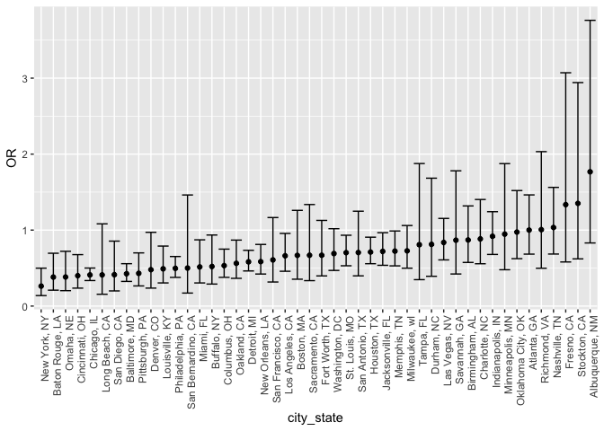

p8105_hw6_ht2630
================
Haotian Tang
2023-12-01

``` r
library(tidyverse)
```

    ## ── Attaching core tidyverse packages ──────────────────────── tidyverse 2.0.0 ──
    ## ✔ dplyr     1.1.2     ✔ readr     2.1.4
    ## ✔ forcats   1.0.0     ✔ stringr   1.5.0
    ## ✔ ggplot2   3.4.3     ✔ tibble    3.2.1
    ## ✔ lubridate 1.9.2     ✔ tidyr     1.3.0
    ## ✔ purrr     1.0.2     
    ## ── Conflicts ────────────────────────────────────────── tidyverse_conflicts() ──
    ## ✖ dplyr::filter() masks stats::filter()
    ## ✖ dplyr::lag()    masks stats::lag()
    ## ℹ Use the conflicted package (<http://conflicted.r-lib.org/>) to force all conflicts to become errors

``` r
library(readr)
library(ggplot2)
library(broom)
library(modelr)
```

    ## 
    ## Attaching package: 'modelr'
    ## 
    ## The following object is masked from 'package:broom':
    ## 
    ##     bootstrap

``` r
library(purrr)
library(stats)
library(boot)
```

Problem 1

``` r
homicide_df = 
  read_csv("data/homicide_data.csv", na = c("", "NA", "Unknown")) |>
  unite(city_state,c(city,state),sep = ', ') |>
  mutate(resolution = case_when(
      disposition == "Closed without arrest" ~ 0,
      disposition == "Open/No arrest"        ~ 0,
      disposition == "Closed by arrest"      ~ 1),
      city_state = ifelse(city_state == "Tulsa, AL", "Tulsa, OK", city_state),
         victim_age = as.numeric(victim_age)) |>
  filter(!city_state %in% c("Dallas, TX", "Phoenix, AZ", "Kansas City, MO", "Tulsa, OK")) |>
  filter(victim_race %in% c("White", "Black")) |>
  select(city_state, resolution, victim_age, victim_sex, victim_race)
```

    ## Rows: 52179 Columns: 12
    ## ── Column specification ────────────────────────────────────────────────────────
    ## Delimiter: ","
    ## chr (8): uid, victim_last, victim_first, victim_race, victim_sex, city, stat...
    ## dbl (4): reported_date, victim_age, lat, lon
    ## 
    ## ℹ Use `spec()` to retrieve the full column specification for this data.
    ## ℹ Specify the column types or set `show_col_types = FALSE` to quiet this message.

``` r
head(homicide_df)
```

    ## # A tibble: 6 × 5
    ##   city_state      resolution victim_age victim_sex victim_race
    ##   <chr>                <dbl>      <dbl> <chr>      <chr>      
    ## 1 Albuquerque, NM          0         15 Female     White      
    ## 2 Albuquerque, NM          0         72 Female     White      
    ## 3 Albuquerque, NM          0         91 Female     White      
    ## 4 Albuquerque, NM          0         56 Male       White      
    ## 5 Albuquerque, NM          0         NA Male       White      
    ## 6 Albuquerque, NM          1         43 Female     White

``` r
baltimore_glm = 
  filter(homicide_df, city_state == "Baltimore, MD") |> 
  glm(resolution ~ victim_age + victim_sex + victim_race, family = binomial(), data = _)

baltimore_glm |> 
  broom::tidy() |> 
  mutate(
    OR = exp(estimate), 
    OR_CI_upper = exp(estimate + 1.96 * std.error),
    OR_CI_lower = exp(estimate - 1.96 * std.error)) |> 
  filter(term == "victim_sexMale") |> 
  select(OR, OR_CI_lower, OR_CI_upper) |>
  knitr::kable(digits = 3)
```

|    OR | OR_CI_lower | OR_CI_upper |
|------:|------------:|------------:|
| 0.426 |       0.325 |       0.558 |

``` r
model_results = 
  homicide_df |> 
  nest(data = -city_state) |> 
  mutate(
    models = map(data, \(df) glm(resolution ~ victim_age + victim_sex + victim_race, 
                             family = binomial(), data = df)),
    tidy_models = map(models, broom::tidy)) |> 
  select(-models, -data) |> 
  unnest(cols = tidy_models) |> 
  mutate(
    OR = exp(estimate), 
    OR_CI_upper = exp(estimate + 1.96 * std.error),
    OR_CI_lower = exp(estimate - 1.96 * std.error)) |> 
  filter(term == "victim_sexMale") |> 
  select(city_state, OR, OR_CI_lower, OR_CI_upper)

model_results |>
  slice(1:5) |> 
  knitr::kable(digits = 3)
```

| city_state      |    OR | OR_CI_lower | OR_CI_upper |
|:----------------|------:|------------:|------------:|
| Albuquerque, NM | 1.767 |       0.831 |       3.761 |
| Atlanta, GA     | 1.000 |       0.684 |       1.463 |
| Baltimore, MD   | 0.426 |       0.325 |       0.558 |
| Baton Rouge, LA | 0.381 |       0.209 |       0.695 |
| Birmingham, AL  | 0.870 |       0.574 |       1.318 |

``` r
model_results |> 
  mutate(city_state = fct_reorder(city_state, OR)) |> 
  ggplot(aes(x = city_state, y = OR)) + 
  geom_point() + 
  geom_errorbar(aes(ymin = OR_CI_lower, ymax = OR_CI_upper)) + 
  theme(axis.text.x = element_text(angle = 90, hjust = 1))
```

<!-- -->

Problem 2

``` r
weather_df = 
  rnoaa::meteo_pull_monitors(
    c("USW00094728"),
    var = c("PRCP", "TMIN", "TMAX"), 
    date_min = "2022-01-01",
    date_max = "2022-12-31") |>
  mutate(
    name = recode(id, USW00094728 = "CentralPark_NY"),
    tmin = tmin / 10,
    tmax = tmax / 10) |>
  select(name, id, everything())
```

    ## using cached file: /Users/synco/Library/Caches/org.R-project.R/R/rnoaa/noaa_ghcnd/USW00094728.dly

    ## date created (size, mb): 2023-12-01 11:20:14.093352 (8.544)

    ## file min/max dates: 1869-01-01 / 2023-11-30

``` r
lm_model = function(data, indices) {
  d = data[indices, ]
  fit = lm(tmax ~ tmin + prcp, data = d)
  r_squared = glance(fit)$r.squared
  beta_estimates = tidy(fit)
  beta_product = beta_estimates$estimate[2] * beta_estimates$estimate[3]

  if(beta_product <= 0) {
    log_beta_product = NA
  } else {
    log_beta_product = log(beta_product)
  }

  return(c(r_squared, log_beta_product))
}

set.seed(123)
results = boot(data = weather_df, statistic = lm_model, R = 5000)

r_squared_bootstrap = results$t[,1]
log_beta_product_bootstrap = results$t[,2]

r_squared_bootstrap = r_squared_bootstrap[is.finite(r_squared_bootstrap)]
log_beta_product_bootstrap = log_beta_product_bootstrap[is.finite(log_beta_product_bootstrap)]

if(length(r_squared_bootstrap) < 100 || length(log_beta_product_bootstrap) < 100) {
  stop("Not enough finite bootstrap samples for analysis.")
}
```

``` r
ggplot() +
  geom_histogram(aes(x = r_squared_bootstrap), binwidth = 0.01, fill = "blue", alpha = 0.5) +
  ggtitle("Bootstrap Distribution of r^2") +
  xlab("r^2") +
  ylab("Frequency")
```

<!-- -->

``` r
ggsave("r_squared_distribution.png", width = 8, height = 6)

ggplot() +
  geom_histogram(aes(x = log_beta_product_bootstrap), binwidth = 0.1, fill = "red", alpha = 0.5) +
  ggtitle("Bootstrap Distribution of log(beta1*beta2)") +
  xlab("log(beta1*beta2)") +
  ylab("Frequency")
```

<!-- -->

``` r
ggsave("log_beta_product_distribution.png", width = 8, height = 6)

ci_r_squared = quantile(r_squared_bootstrap, c(0.025, 0.975), na.rm = TRUE)
ci_log_beta_product = quantile(log_beta_product_bootstrap, c(0.025, 0.975), na.rm = TRUE)

ci_r_squared
```

    ##      2.5%     97.5% 
    ## 0.8886348 0.9403299

``` r
ci_log_beta_product
```

    ##      2.5%     97.5% 
    ## -8.957548 -4.551465

1.  The bootstrap distribution of log beta product shows a multimodal
    and left-skewed distribution with several peaks, which may indicate
    the presence of multiple common values on the larger values. And the
    range of distribution is ver wide, which suggests a relatively high
    variability.

2.  The bootstrap distribution of r squared shows nimodal, slightly
    left-skewed but nearly uniform distribution and The peak of the
    distribution is quite sharp at 0.920. Compared to the bootstrap
    distribution of log beta product, it has lower variablility.

Problem 3

``` r
birthweight_df = read_csv("data/birthweight.csv")
```

    ## Rows: 4342 Columns: 20
    ## ── Column specification ────────────────────────────────────────────────────────
    ## Delimiter: ","
    ## dbl (20): babysex, bhead, blength, bwt, delwt, fincome, frace, gaweeks, malf...
    ## 
    ## ℹ Use `spec()` to retrieve the full column specification for this data.
    ## ℹ Specify the column types or set `show_col_types = FALSE` to quiet this message.

``` r
birthweight_df = birthweight_df |>
  mutate(
    babysex = as.factor(babysex),
    frace = as.factor(frace),
    malform = as.factor(malform),
    mrace = as.factor(mrace)
  ) |> 
  drop_na()

model_1 = lm(bwt ~ gaweeks + malform + ppwt + ppbmi + smoken + momage + mrace + frace, data = birthweight_df)
model_2 = lm(bwt ~ blength + gaweeks, data = birthweight_df)
model_3 = lm(bwt ~ bhead * blength * babysex, data = birthweight_df)
```

``` r
birthweight_df = birthweight_df |>
  add_predictions(model_1, var = "pred") |>
  add_residuals(model_1, var = "resid")

ggplot(birthweight_df, aes(x = pred, y = resid)) +
  geom_point() +
  geom_hline(yintercept = 0, linetype = "dashed") +
  labs(title = "Residuals vs Fitted Values", x = "Fitted Values", y = "Residuals")
```

<!-- -->

``` r
ggsave("Residuals vs Fitted Values.png", width = 8, height = 6)
```

``` r
cv_rmse = function(model_formula, data) {
  cv_results = cv.glm(data, glm(model_formula, data = data), K = 10)
  return(sqrt(cv_results$delta[1]))
}

cv_rmse_1 = cv_rmse(formula(model_1), birthweight_df)
cv_rmse_2 = cv_rmse(formula(model_2), birthweight_df)
cv_rmse_3 = cv_rmse(formula(model_3), birthweight_df)

list(cv_rmse_1 = cv_rmse_1, cv_rmse_2 = cv_rmse_2, cv_rmse_3 = cv_rmse_3)
```

    ## $cv_rmse_1
    ## [1] 436.4643
    ## 
    ## $cv_rmse_2
    ## [1] 334.4383
    ## 
    ## $cv_rmse_3
    ## [1] 289.0637

The MSE of three models are 436.4642975, 334.4383194, and 289.0636773.
The third model, which includes head circumference, length, sex, and all
their interaction terms, has the lowest cross-validated prediction
error. It indicates the third model might be the best at predicting the
birth weight. In addition, the second model also has lower MSE than the
first one, suggesting that length at birth and gestational age are
robust predictors of birth weight. The reason why the first model has
highest MSE might be overfitting since it includes too many variables.
